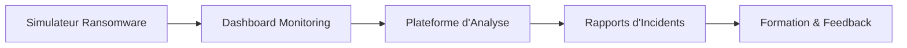

# 🛡️ Ransomware Simulator - Orange Cyberdefense Training Tool

<p align="center">
  
  
  
  
</p>

<p align="center">
  <strong>⚠️ AVERTISSEMENT LÉGAL ⚠️</strong><br>
  Ce simulateur est développé exclusivement pour les formations en cybersécurité d'Orange Cyberdefense.<br>
  <strong>Toute utilisation malveillante est strictement interdite et illégale.</strong>
</p>

---

## 📋 Table des matières

- [À propos](#-à-propos)
- [Fonctionnalités](#-fonctionnalités)
- [Architecture](#-architecture)
- [Installation](#-installation)
- [Utilisation](#-utilisation)
- [Intégration Orange Cyberdefense](#-intégration-orange-cyberdefense)
- [Sécurité](#-sécurité)
- [FAQ](#-faq)

---

## 🎯 À propos

Le **Ransomware Simulator** est un outil pédagogique développé par Orange Cyberdefense pour former les professionnels de la cybersécurité à la détection, l'analyse et la réponse aux attaques par ransomware. Ce simulateur reproduit fidèlement le comportement visuel et certaines fonctionnalités d'un vrai ransomware, sans causer aucun dommage réel.

### Objectifs pédagogiques

- 🔍 **Comprendre** les mécanismes internes d'un ransomware
- 🚨 **Identifier** les indicateurs de compromission (IoC)
- 🛡️ **Développer** des stratégies de détection efficaces
- 🚀 **Pratiquer** la réponse à incidents en temps réel
- 📚 **Sensibiliser** aux impacts d'une attaque ransomware

---

## ✨ Fonctionnalités

### 🖥️ Interface Utilisateur

- **Mode plein écran** avec verrouillage de l'interface
- **Animation ASCII** d'un crâne en 4 frames
- **Compte à rebours** dramatique (configurable)
- **Effets visuels** : clignotement, scan-lines, dégradés
- **QR Code** pour simuler une demande de rançon
- **Alarmes sonores** périodiques

### 📊 Collecte de Données

| Type de données | Description |
|----------------|-------------|
| 🔤 **Keylogger** | Enregistrement des frappes clavier |
| 🖱️ **Tracking souris** | Mouvements et clics |
| 💻 **Infos système** | Hostname, MAC, CPU, RAM |
| 📋 **Processus** | Liste des applications actives |

### 🌐 Communication Réseau

```json
{
  "ip": "193.168.5.77",
  "hostname": "WORKSTATION-01",
  "country": "France",
  "mac": "AA:BB:CC:DD:EE:FF",
  "timestamp": "2025-01-07T10:30:00Z",
  "keystrokes": ["ctrl", "alt", "del", "enter"]
}
```

### 📝 Journalisation

- Logs détaillés dans `ransomware_logs.txt`
- Export JSON dans `dashboard_data.json`
- Buffer de logs en mémoire pour analyse temps réel

---

## 🏗️ Architecture

```
┌─────────────────────────────────────────────┐
│          Interface Graphique (GUI)          │
├─────────────────────────────────────────────┤
│  ┌───────────┐  ┌───────────┐  ┌─────────┐ │
│  │ Animation │  │  Timer    │  │  Audio  │ │
│  │  Engine   │  │  System   │  │ Alerts  │ │
│  └───────────┘  └───────────┘  └─────────┘ │
├─────────────────────────────────────────────┤
│           Modules de Collecte               │
│  ┌───────────┐  ┌───────────┐  ┌─────────┐ │
│  │ Keylogger │  │  System   │  │ Network │ │
│  │   Hook    │  │   Info    │  │  Comms  │ │
│  └───────────┘  └───────────┘  └─────────┘ │
├─────────────────────────────────────────────┤
│             Système de Logs                 │
└─────────────────────────────────────────────┘
```

---

## 🚀 Installation

### Prérequis

- **OS** : Windows 10/11
- **Compilateur** : MinGW, MSVC ou compatible
- **Bibliothèques** : Windows SDK standard

### Compilation

#### Option 1 : MinGW

```bash
gcc simulateur.c -o ransomware_sim.exe -lwininet -lws2_32 -lwinmm -lrpcrt4 -liphlpapi -mwindows
```

#### Option 2 : Visual Studio

```cmd
cl simulateur.c /Fe:ransomware_sim.exe /link wininet.lib ws2_32.lib winmm.lib rpcrt4.lib iphlpapi.lib user32.lib gdi32.lib
```

#### Option 3 : Mode Debug

```bash
gcc simulateur.c -o ransomware_sim_debug.exe -D_DEBUG -lwininet -lws2_32 -lwinmm -lrpcrt4 -liphlpapi -mwindows
```

### Fichiers requis

| Fichier | Description | Obligatoire |
|---------|-------------|-------------|
| `simulateur.c` | Code source principal | ✅ |
| `qr.bmp` | QR code pour la rançon | ✅ |
| `alarm.wav` | Son d'alarme | ❌ |

---

## 📖 Utilisation

### Démarrage

1. **Préparer l'environnement** : Placer tous les fichiers dans le même dossier
2. **Configurer le dashboard** : S'assurer que le serveur écoute sur `192.168.240.249:3001`
3. **Lancer le simulateur** : Double-cliquer sur `ransomware_sim.exe`

### Contrôles

| Touche | Action |
|--------|--------|
| `ESC` | Quitter le simulateur |
| `F12` | Sortie alternative |

### Mode Debug

En mode debug, vous aurez accès à :
- 📊 Logs en temps réel à l'écran
- 🔍 Messages de débogage détaillés
- ℹ️ Instructions de sortie visibles

---

## 🔧 Intégration Orange Cyberdefense

### Écosystème de formation



### Scénarios d'utilisation

1. **Formation initiale** : Découverte des ransomwares
2. **Exercices Blue Team** : Détection et containment
3. **Simulations Red Team** : Tests d'intrusion
4. **Sensibilisation** : Démonstrations pour dirigeants

### Dashboard de monitoring

Le simulateur communique avec un dashboard centralisé permettant :
- 📈 Visualisation en temps réel des attaques
- 🗺️ Cartographie des infections
- 📊 Analyse comportementale
- 🔔 Alertes automatisées

---

## 🔒 Sécurité

### Mesures de protection

- ✅ **Aucun chiffrement réel** de fichiers
- ✅ **Touches d'échappement** toujours actives
- ✅ **Communication** uniquement vers serveur de test
- ✅ **Code source** transparent et auditable
- ✅ **Logs complets** de toutes les actions

### Conformité

- Conforme aux standards Orange Cyberdefense
- Respecte les réglementations sur la formation en cybersécurité
- Approuvé pour usage en environnement contrôlé

---

## ❓ FAQ

<details>
<summary><strong>Le simulateur peut-il endommager mon système ?</strong></summary>

Non. Le simulateur ne modifie, ne supprime ni ne chiffre aucun fichier. Il simule uniquement l'interface visuelle et collecte des données de démonstration.
</details>

<details>
<summary><strong>Puis-je utiliser ce code pour mes propres formations ?</strong></summary>

L'utilisation est restreinte aux formations Orange Cyberdefense. Pour toute autre utilisation, contactez l'équipe légale d'Orange Cyberdefense.
</details>

<details>
<summary><strong>Comment personnaliser le simulateur ?</strong></summary>

Les paramètres principaux (IP serveur, durée, etc.) sont définis dans le code source. Modifiez les constantes au début du fichier pour adapter le comportement.
</details>

<details>
<summary><strong>Que faire si le simulateur ne se ferme pas ?</strong></summary>

Redemarrer son PC. Car le Ctrl + Alt + Supp est bloqué en second plan.
</details>

---

---

<p align="center">
  <strong>Orange Cyberdefense / Bachelor Cyber Securité ISEN</strong><br>
  <em>Votre partenaire de confiance en cybersécurité</em><br><br>
  <sub>© 2025 Grep2Raisin - Tous droits réservés</sub>
</p>